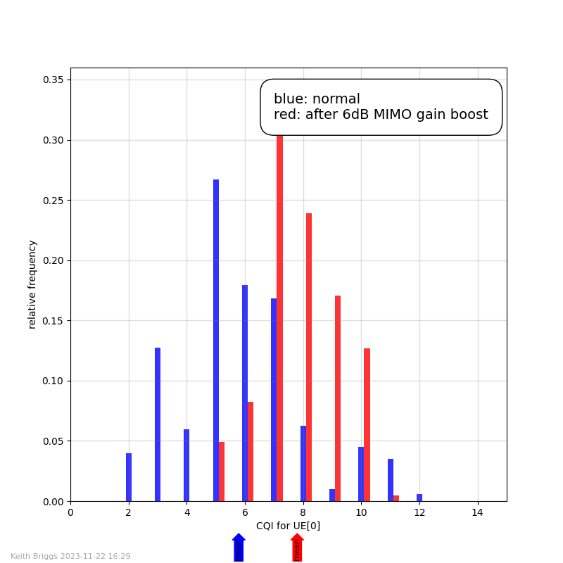

.. AIMM_simulator documentation master file, created by
   sphinx-quickstart on Mon Mar 15 16:10:21 2021.
   Indices and tables
   ------------------

   * :ref:`genindex`
   * :ref:`modindex`
   * :ref:`search`

.. toctree::
   :maxdepth: 2
   :caption: Contents:

AIMM simulator documentation
============================

Last modified: |today|

Purpose
-------

The AIMM simulator emulates a cellular radio system roughly following 5G concepts and channel models. The intention is to have an easy-to-use and fast system written in pure Python with minimal dependencies. It is especially designed to be suitable for interfacing to AI engines such as ``tensorflow`` or ``pytorch``, and it is not a principal aim for it to be extremely accurate at the level of the radio channel. The simulator was developed for the `AIMM project <https://aimm.celticnext.eu>`_.

The github sources are at <https://github.com/keithbriggs/AIMM-simulator>.

Software dependencies
---------------------

1. `Python 3.8 <https://python.org>`_ or higher.
2. `NumPy <https://numpy.org/>`_.
3. `Simpy <https://pypi.org/project/simpy/>`_.
4. If real-time plotting is needed, `matplotlib <https://matplotlib.org>`_, with an appropriate backend such as PyQt5 (``pip install PyQt5``).

Installation
------------

Downloading the wheel from github (typically ``dist/aimm_simulator-2.0.0-py3-none-any.whl``) and running ``pip install <wheel>`` should be all that is needed.

Alternatively, the package can be installed by downloading the complete repository (using the green ``<> Code ⌄`` button), and then doing ``make install_local``. 

After the installation, test it with ``python3 examples/basic_test.py``.

Note that a plotting utility ``src/realtime_plotter.py`` is included but not installed.  If needed, this script should be placed somewhere in your python path. 
A folder ``img`` is used by the examples to save plots in png and pdf format.  So in order to run the examples with plotting, this folder must be created.

The documentation can be built from the sources with ``make doc``.

Quick start
-----------

The following example will test the installation and introduce the basic concepts.  This creates a simulator instance ``sim``, creates one cell, creates one UE and immediately attaches it to the cell, and runs for 100 seconds of simulated time (typically about 0.03 seconds of run time).  There is no logger defined, which means there will be no output apart from a few set-up messages (which are sent to stderr).  The code is in ``AIMM_simulator_example_n0.py``.

.. code-block:: python

    from AIMM_simulator import Sim
    sim=Sim()
    sim.make_cell()
    sim.make_UE().attach_to_nearest_cell()
    sim.run(until=100)

The basic steps to build and run a simulation are:

1. Create a ``Sim`` instance.
2. Create one or more cells with ``make_cell()``. Cells are given a unique index, starting from 0.
3. Create one or more UEs with ``make_UE()``. UEs are given a unique index, starting from 0.
4. Attach UEs with the method ``attach_to_nearest_cell()``.
5. Create a ``Scenario``, which typically moves the UEs according to some mobility model, but in general can include any events which affect the network.
6. Create one or more instances of ``Logger``.
7. Optionally create a ``RIC``, possibly linking to an AI engine.
8. Start the simulation with ``sim.run()``.
9. Plot or analyse the results in the logfiles.

The AIMM simulator uses a discrete event simulation framework.    Internally, a queue of pending events is maintained, but this is invisible to the programmer.
All functions and classes have default arguments appropriate to the simulation of a 5G macrocell deployment at 3.5GHz.  This means that setting up a simple simulation is almost trivial, but also means that care is needed to set parameters correctly for other scenarios.  Subbanding is implemented on all ``Cell`` objects, but the number of subbands may be set to 1, effectively switching off this feature.

The AIMM simulator normally operates without a graphical user interface, and just writes logfiles for subsequent analysis.   The default logfile format is tab-separated columns, with purely numerical data.  These files can then be easily processed with shell utilities such as ``cut``, ``head``, ``tail``, etc., or read into python or R scripts, or, if all else fails, even imported into spreadsheet programs.  However, a custom logger can create a logfile in any desired format.

AIMM simulator blocks
---------------------

.. figure:: AIMM_Simulator_block_diagram.png
   :scale: 50 %
   :alt: AIMM simulator block diagram

   AIMM simulator block structure.

Tutorial examples
-----------------

Example 1
~~~~~~~~~

This example (the code is in ``AIMM_simulator_example_n1.py``) creates a simulator instance, creates one cell, creates four UEs and immediately attaches them to the cell, adds a default logger, and runs for 100 seconds of simulated time.  UEs by default are placed randomly in a 1km square.

.. literalinclude:: ../../examples/AIMM_simulator_example_n1.py
   :language: python
   :linenos:
   :lines: 4,6-10

Typical output follows.   The locations are 3-dimensional, with the z component being the antenna height.   The default logger prints 3 columns to stdout, with a row for each UE report: cell index, UE index, CQI value.  We will see later how to create a custom logger.

.. code-block:: text

  Cell[0] is at [434.44 591.64  20.  ]
  UE[0]   is at [602.14 403.7    2.  ]
  UE[1]   is at [263.87 301.28   2.  ]
  UE[2]   is at [319.12 506.63   2.  ]
  UE[3]   is at [370.7  394.92   2.  ]
  Sim: starting main loop for simulation time 100 seconds...
  0	0	15
  0	1	15
  0	2	15
  0	3	15
  ...
  Sim: finished main loop in 0.04 seconds.

Example 2 - adding a scenario
~~~~~~~~~~~~~~~~~~~~~~~~~~~~~

A scenario is created by subclassing the ``Scenario`` class. The code is in ``AIMM_simulator_example_n2.py``.  The subclass must implement the ``loop`` method as in the example: it must have an infinite loop, yielding an ``s.sim.wait()`` object, which determines the time to the next event; in this case the next change to the UE positions.  In this example, an MME is also added.   This handles UE handovers, and ensures that UEs are always attached to the nearest cell.

.. literalinclude:: ../../examples/AIMM_simulator_example_n2.py
   :language: python
   :linenos:
   :lines: 5-

Example 3 - adding a custom logger
~~~~~~~~~~~~~~~~~~~~~~~~~~~~~~~~~~

There are two ways to create a custom logger.   The simplest way is to specify a function when creating the Logger instance. This function must accept two arguments, the Sim instance and the file object to write to. Example code for this method is in ``AIMM_simulator_example_n3a.py``. The custom logger must format a line of output, and write it to the file object ``f``.  Access to all simulation variables is possible; see the API documentation below. A convenience function ``np_array_to_str`` is available, which removes square brackets and commas from normal numpy array formatting.

.. literalinclude:: ../../examples/AIMM_simulator_example_n3a.py
   :language: python
   :linenos:
   :lines: 4-

More generally, a custom logger can be created by subclassing the ``Logger`` class.   The subclass must implement the ``loop`` method as in the example: it must have an infinite loop, yielding an ``s.sim.wait()`` object, which determines the time to the next write to the logfile (which defaults to stdout). The custom logger must format a line of output, and write it to the file object ``self.f``. Example code for this method is in ``AIMM_simulator_example_n3.py``.

.. literalinclude:: ../../examples/AIMM_simulator_example_n3.py
   :language: python
   :linenos:
   :lines: 4-

Typical output is:

.. code-block:: text

  #time	cell	UE	x	y	throughput Mb/s
  0.0	0	5	618	694	6.63
  0.0	0	7	435	549	1.17
  0.0	1	1	709	593	13.26
  0.0	2	0	395	405	0.98
  0.0	2	2	567	266	2.65
  0.0	2	3	718	496	0.61
  0.0	2	4	484	346	2.65
  0.0	2	6	310	377	0.61
  1.0	0	5	616	694	6.63
  1.0	0	7	437	548	1.17
  1.0	1	1	710	592	13.26
  1.0	2	0	395	406	0.98
  1.0	2	2	566	264	2.05
  1.0	2	3	719	497	0.61
  1.0	2	4	484	347	2.65
  1.0	2	6	312	377	0.61

Example 4 - adding a RIC
~~~~~~~~~~~~~~~~~~~~~~~~

A RIC (radio intelligent controller) is an agent able to control any aspect of a cell configuration in real time.  This toy example illustrates the detection of the UE with the lowest throughout (``throughputs[0][1]``, after the sort), and allocates a new subband to the cell serving that UE.

.. literalinclude:: ../../examples/AIMM_simulator_example_n4.py
   :language: python
   :linenos:
   :lines: 4-

Example 5 - adding an antenna radiation pattern
~~~~~~~~~~~~~~~~~~~~~~~~~~~~~~~~~~~~~~~~~~~~~~~

In this example there are two cells, and one UE which is driven around a circle centred on Cell[0] by the MyScenario class. There is no MME, so no handovers occur. With omnidirectional antennas, the UE would be exactly at the cell edge at times which are multiples of 100 seconds.   But with the pattern implemented for Cell[0] in line 29, the antenna has a beam pointing east, towards the interfering cell (Cell[1], which remains omnidirectional).  This considerable improves the average throughput.

.. literalinclude:: ../../examples/AIMM_simulator_example_n5.py
   :language: python
   :linenos:
   :lines: 6-

A typical command to run this using the real-time plotter would be:

``python3 AIMM_simulator_example_n5.py | ./realtime_plotter_05.py -np=3 -tm=500 -ylims='{0: (-100,100), 1: (-100,100), 2: (0,45)}' -ylabels='{0: "UE[0] $x$", 1: "UE[0] $y$", 2: "UE[0] throughput"}' -fnb='img/AIMM_simulator_example_n5'``.

This generates a plot like this:

Example 6 - a hetnet (heterogeneous network) with macro and small cells
~~~~~~~~~~~~~~~~~~~~~~~~~~~~~~~~~~~~~~~~~~~~~~~~~~~~~~~~~~~~~~~~~~~~~~~

In this example we start with 9 macro-cells in a 3x3 grid arrangement (line 30).  We then drop 50 UEs at random into the system (line 32), and start the simulation (there is no UE mobility). The logger just computes the average throughput over all UEs. The scenario has these discrete events:

1. At time 20, 20 small cells at random locations are added to the system  (line 8).  There is a drop in average throughput because the new cells just generate interference and are not yet used as serving cells.
2. At time 40, the UEs are reattached to the best cell (line 11).  Now throughput improves to above the initial value, because some UEs are now served by a nearby small cell.
3. At time 60, subband masks are applied to make the macro and small cells non-interfering.  Macro cells are given 1/4 of the channel bandwidth (line 15), and the small cells have 3/4 of the channel bandwidth (line 17).   Now throughput improves further.   As this subband allocation will not be optimal, further improvement will still be possible.

.. literalinclude:: ../../examples/AIMM_simulator_example_n6.py
   :language: python
   :linenos:
   :lines: 4-

The command

``python3 AIMM_simulator_example_n6.py | ./realtime_plotter_03.py -np=1 -tm=100 -ylims='(0,0.25)' -ylabels='{0: "average downlink throughput over all UEs"}' -fnb='img/AIMM_simulator_example_n6'``

then generates a plot like this:

Example 7 - a hetnet with mobility
~~~~~~~~~~~~~~~~~~~~~~~~~~~~~~~~~~

This is similar to example 6, but now an MME is added to perform handovers for the mobile UEs.

.. literalinclude:: ../../examples/AIMM_simulator_example_n7.py
   :language: python
   :linenos:
   :lines: 4-

The command

``python3 AIMM_simulator_example_n7.py | ./realtime_plotter_03.py -np=4 -tm=2000 -ylims='{0: (0,10), 1: (0,1000), 2: (0,1000), 3: (0,30)}' -ylabels='{0: "UE[0] throughput", 1: "UE[0] $x$", 2: "UE[0] $y$", 3: "UE[0] serving cell"}' -fnb='img/AIMM_simulator_example_n7'``

then generates a plot like this:

Example 8 - estimating CQI distribution
~~~~~~~~~~~~~~~~~~~~~~~~~~~~~~~~~~~~~~~

This is similar to example 7, but now we create a histogram at the end of the simulation, rather than using real-time plotting.  A MIMO gain boost is added half-way through the simulation, in order to observe the effect on the CQI values at UE[0].  This example also illustrates the use of the ``finalize`` function, to create the histograms after the simulation has finished.

.. literalinclude:: ../../examples/AIMM_simulator_example_n8.py
   :language: python
   :linenos:
   :lines: 4-

The command

``python3 AIMM_simulator_example_n8.py``

then generates a plot like this:

Using the geometry_3d module
----------------------------

This module is provided for running indoor simulations, and takes account of wall adsorptions, but not reflections or diffraction.  It is not a full ray-tracing code.  The main task it performs is to compute intersections of signal paths with walls, and it is optimized to be fast for this application. An example of usage is below.

More details on usage to be added here.

.. code-block:: python

  from geometry_3d import block,Panel,Building,Ray,draw_building
  blk0=block(np.array([0, 0,0]),np.array([5,10,3]))
  blk1=block(np.array([0,10,0]),np.array([6,12,2]))
  blk2=block(np.array([0,12,0]),np.array([6,14,2]))
  blk3=block(np.array([0,14,0]),np.array([6,16,2]))
  blk4=block(np.array([0,16.5,0]),np.array([6,17,2]))
  fence=Panel([Triangle((8,0,0),(8,15,0),(8,15,1)),
               Triangle((8,0,1),(8, 0,0),(8,15,1))])
  b=Building(blk0+blk1+blk2+blk3+blk4+(fence,))
  ray0=Ray((0.3,0.3,2.0),(0.1,1,-0.01))
  line_segments=[(8,8),(18,18),(0,4)] # [xs,ys,zs]
  draw_building(b,rays=[ray0],line_segments=line_segments,color='y',limits=[(0,10),(0,20),(0,4)],labels=['$x$','$y$','$z$'],fontsize=6,show=True,pdffn='building0.pdf')

This constructs a building like this:

.. figure:: ../../examples/img//building0.png
   :scale: 80 %
   :alt: building0.png

Using the real-time plotting utility
------------------------------------

As an aid to development and debugging, a stand-alone python script ``realtime_plotter_05.py`` for real-time plotting is included.   This reads stdin and plots in a window as the data is generated.  By default, png and pdf images are saved when all data has been read.   It is configured with these command-line arguments:

.. code-block:: text

  -np      number of plots (default 1)
  -tm      t_max (maximum time on x-axis, default 10)
  -xl      x-axis label (default 'time')
  -fst     final sleep time (before closing the window and saving the images)
  -fnb     filename base
  -ylims   y-axis limits (a python dictionary)
  -ylabels y-axis labels (a python dictionary
  -title   figure title
  -lw      line width (default 2)

If ``-fnb`` is specifed, the final plot is saved as png and pdf figures.
Typical usage would be in a bash script like this:

.. literalinclude:: ../../examples/run_RIC_example.sh
   :language: bash
   :linenos:
   :lines: 4-

This generates a plot like this:

.. figure:: ../../examples/img/AIMM_simulator_RIC_example.png
   :scale: 80 %
   :alt: AIMM_simulator_RIC_example.png

Simulator module API reference
------------------------------

AIMM simulator
~~~~~~~~~~~~~~

.. automodule:: AIMM_simulator
   :members: Sim,Cell,UE,Scenario,MME,RIC,Logger 

NR 5G standard functions
~~~~~~~~~~~~~~~~~~~~~~~~

.. automodule:: NR_5G_standard_functions
   :members:

UMa pathloss model
~~~~~~~~~~~~~~~~~~~

.. automodule:: UMa_pathloss_model
   :members:
   :special-members:
   :exclude-members: __dict__,__weakref__,_PL1,_PL2

UMi pathloss model
~~~~~~~~~~~~~~~~~~~

.. automodule:: UMi_pathloss_model
   :members:
   :special-members:
   :exclude-members: __dict__,__weakref__,_PL1,_PL2

InH pathloss model
~~~~~~~~~~~~~~~~~~~

.. automodule:: InH_pathloss_model
   :members:
   :special-members:
   :exclude-members: __dict__,__weakref__,_PL1,_PL2

geometry_3d module
~~~~~~~~~~~~~~~~~~

.. automodule:: geometry_3d
   :members:
   :exclude-members: distance_to_plane,test_05,intersect_triangle

Real-time plotting utility
~~~~~~~~~~~~~~~~~~~~~~~~~~

This is independent of the main simulator code.  It reads output from the Logger via a pipe from stdin, and plots it using a matplotlib animation. It is driven with command-line options, which can be seen by running ``realtime_plotter.py --help``.

.. code-block:: text

  -h, --help            show this help message and exit
  --selftest            self-test
  -naxes NAXES          number of axes
  -nplots NPLOTS        number of plots
  -tmax TMAX            t_max
  -xlabel XLABEL        x axis label
  -fst FST              final sleep time
  -fnb FNB              filename base
  -ylims YLIMS          y limits (dict)
  -ylabels YLABELS      ylabels (dict)
  -title TITLE          figure title
  -lw LW                plot linewidth
  -author AUTHOR        author name for plot bottom margin
  -extra EXTRA          extra features to be added to the plot; raw python code
  -inputfile INPUTFILE  file to read input from instead of stdin; in this case the plot is not displayed, but written to an mp4 file
  -column_to_axis_map COLUMN_TO_AXIS_MAP column_to_axis_map (dict)

..
  .. argparse::
     :module: realtime_plotter
     :func: main
     :prog: realtime_plotter

Last modified: |today|
